# Projects

A selection of things I've built, mostly for school. Most repos are private due to school policy (other students are working on the same assignments), but drop me a line, if you want to see them.

---

## kood/Sisu Projects (2025 – 2026)

### Ghostwriter – AI Content Generation Platform (2026)
**Solo project**


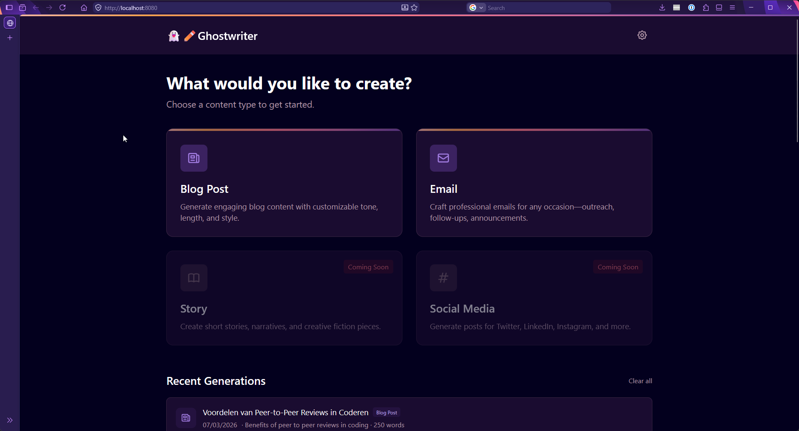

Stateless content generation tool for blog posts and emails. Fill out a form with content requirements and style preferences, get streamed output that can be refined, edited, and exported.

- Vendor-agnostic via OpenRouter with direct provider fallbacks (OpenAI, Anthropic, Google, DeepSeek, Mistral, Grok)
- OpenAI or Anthropic formatted API requests, based on provider
- XML-structured prompting with self-validation loop. LLM grades its own output against criteria
- Server-side overrides for mechanically verifiable checks (word count, header structure)
- Auto-refinement up to 5 passes with lower temperature and specific feedback
- Temperature, max tokens, top-p, frequency penalty, and presence penalty are all configurable per-generation through the UI
- Input sanitization: unicode normalization, (very rudimentary) injection detection, structural tag blocklist
- Real-time SSE streaming for responsive UI
- Export to PDF, DOCX, Markdown, HTML, Rich Text, BBCode, plain text
- Optional browser-side API key storage for bring-your-own-key usage

[](https://github.com/mikapitkala/projects-readme/tree/main/ghostwriter) [-181717?style=for-the-badge&logo=github&logoColor=white)](https://github.com/mikapitkala/ghostwriter)

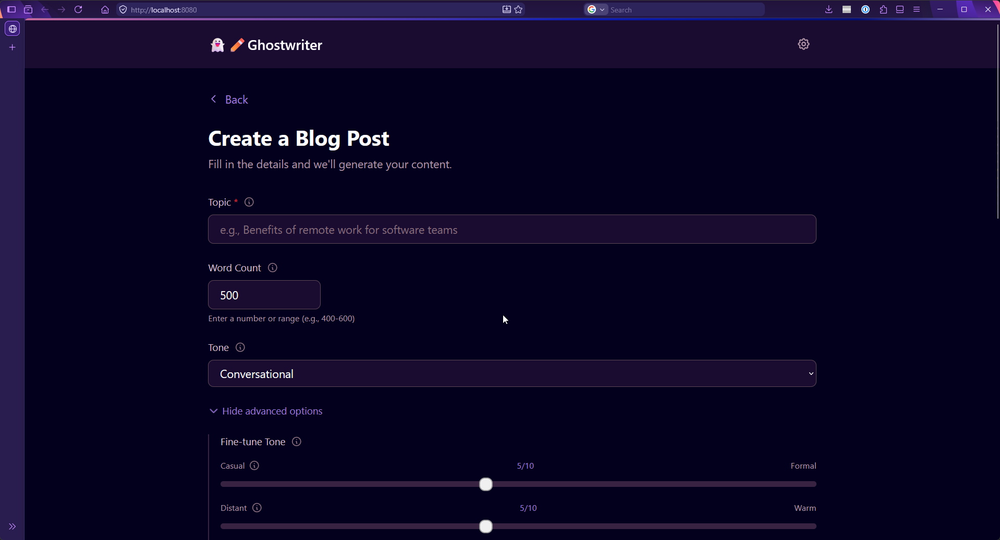
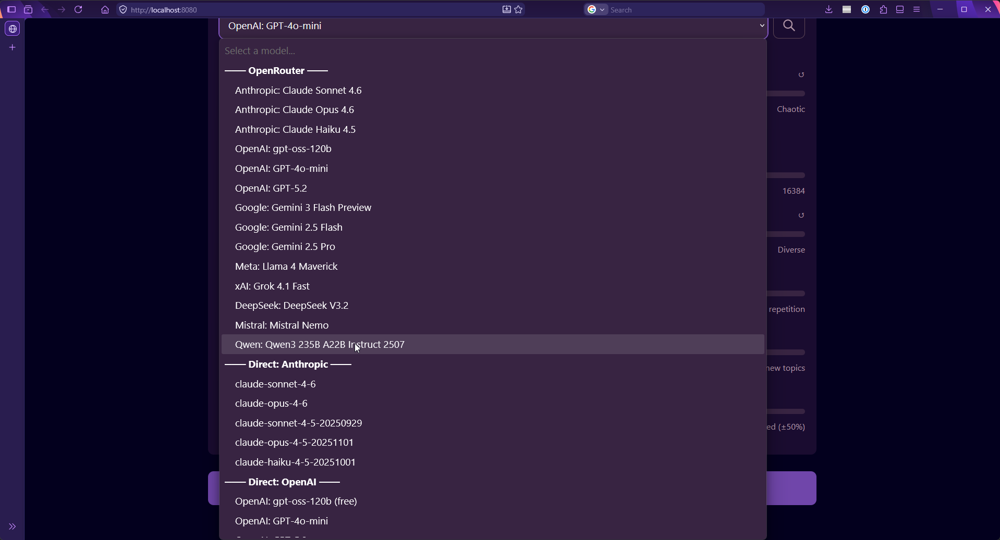
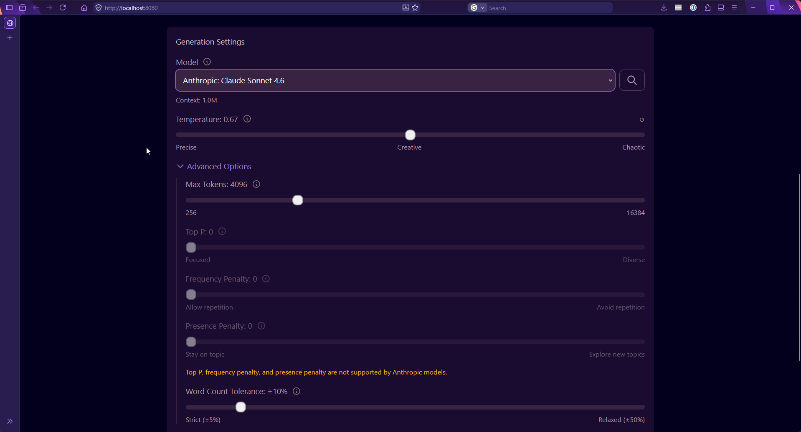
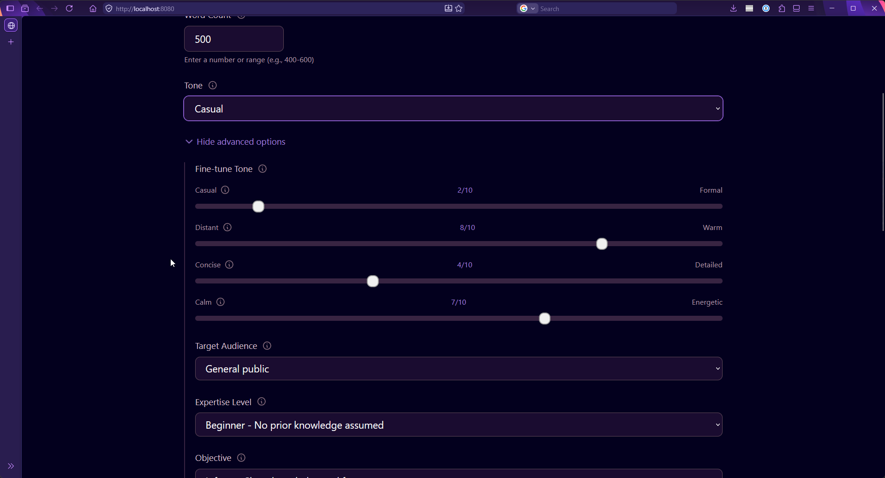

---

### kood/Melee – Multiplayer Space Combat Arena (2025)
**Group project** (with [@Pavka-dev](https://github.com/Pavka-dev))


https://github.com/user-attachments/assets/83505791-1ed6-42bb-8db3-7cffd0180588

Star Control 2 Supermelee inspired real-time combat for 2-4 players in the browser. Newtonian(ish) physics, diverse ship loadouts, and intense multiplayer battles.

- Zero canvas, zero images - ships are font glyphs, explosions are CSS gradients and box-shadows, stars are procedural dots
- (Ok, one image - the favicon is a screenshot of the CSS logo)
- Hardware-accelerated DOM rendering via `will-change: transform`
- Newtonian physics with three drag presets: beginner (arcade), medium (balanced), advanced (true Newtonian, no drag; the *correct* option)
- Spatial audio via Web Audio API with 3D positioning based on viewport
- Dynamic music - three intensity layers blend in real-time based on combat state
- Host-authoritative multiplayer with automatic host migration if the host disconnects
- Observer mode when lobby is full (4 players)
- 6 ship hulls with distinct stat profiles (Armor, Reactor, Recharge, Thrust, Agility)
- 4 primary weapons, 6 secondary abilities, 12 pre-built archetype loadouts
- Multiple game modes: Deathmatch, Last Ship Standing, Sudden Death
- Gravity well with inverse-square mechanics for slingshot maneuvers or dragging enemies to their doom
- Screen wrapping - fly off one edge, appear on the opposite. Bounce off Arena borders
- Dynamic camera that zooms and pans to keep all ships in view
- Local multiplayer (up to 4 players on one keyboard) and online multiplayer
- 30Hz state sync with client-side interpolation
- 60 FPS target with fixed 16.67ms physics timestep

[](https://github.com/mikapitkala/projects-readme/tree/main/multi-player) [-181717?style=for-the-badge&logo=github&logoColor=white)](https://github.com/mikapitkala/multi-player)

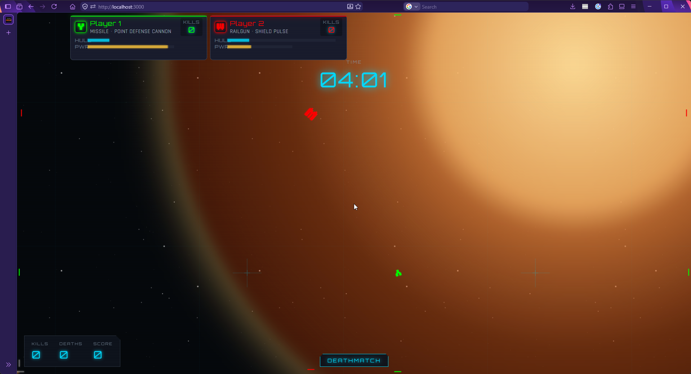
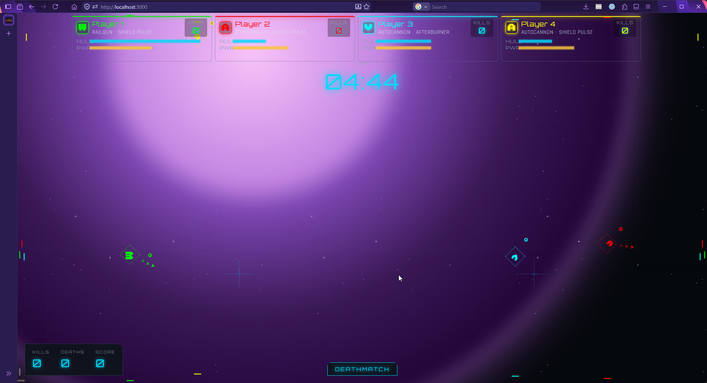

---

### dot-js – Frontend Framework from Scratch (2025)
**Group project** (with [@Pavka-dev](https://github.com/Pavka-dev))


https://github.com/user-attachments/assets/72b5312a-33b6-4cc3-aa4b-8899ce9f3b3b

A reactive frontend framework built without a virtual DOM. Import via ES modules and run - no build step, no tooling.

- Signals-based reactivity with O(1) fine-grained DOM updates
- Reactive markers update the DOM directly - no diffing, no wasted cycles
- Built-in scheduler for batched updates
- Global event delegation
- Dedicated router
- Ships with a classless CSS framework for styling out of the box
- Interactive 16-step tutorial built using the framework itself
- Performance comparison example against a vanilla JS todo app
- Minimal development server included (built-in Node modules only, no `npm install` required)
- Zero build steps

[](https://github.com/mikapitkala/projects-readme/tree/main/frontend-framework) [](https://github.com/mikapitkala/projects-readme/tree/main/frontend-framework/docs) [-181717?style=for-the-badge&logo=github&logoColor=white)](https://github.com/mikapitkala/frontend-framework)

---

### match-me – Recommendation Platform (2025)
**Group project** (with [@Pavka-dev](https://github.com/Pavka-dev))


Full-stack social platform with geospatial matching and recommendation scoring.

- Weighted compatibility scoring based on bio, interests, location
- PostGIS-powered geographical proximity matching
- Real-time chat via WebSockets
- JWT-based authentication with secure session handling
- Watercolor-themed UI with randomized pastel backgrounds and sketch effects on every page
- Swipe interactions with hand-drawn animation effects
- Custom launcher (Go binary) manages the full stack: PostgreSQL + PostGIS via Docker, backend API on :8080, Vite frontend on :5173
- Launcher auto-checks system requirements and provides setup guidance
- Primarily responsible for frontend

[](https://github.com/mikapitkala/projects-readme/tree/main/match-me) [-181717?style=for-the-badge&logo=github&logoColor=white)](https://github.com/mikapitkala/match-me)

---

### racetrack – Race Management System (2025)
**Group project** (with [@Pavka-dev](https://github.com/Pavka-dev))


Real-time race management system with role-based interfaces and live synchronization.

- Four management interfaces: front desk (session management), race control (safety/flags), lap tracker (timing), public leaderboard
- Role-based authentication with server-side key validation
- Real-time synchronization across all interfaces via Socket.IO
- Unified dashboard combining all views for race control center
- Mobile-responsive design for tablet and phone access
- State recovery - active races continue after server restart, timing and lap data preserved
- Test data mode with explicit confirmation to prevent accidental data loss
- Configurable race durations (60s for dev, 10min for production)

[](https://github.com/mikapitkala/projects-readme/tree/main/racetrack) [-181717?style=for-the-badge&logo=github&logoColor=white)](https://github.com/mikapitkala/racetrack)

---

### literary-lions – Book Discussion Forum (2025)
**Group project** (with [@Pavka-dev](https://github.com/Pavka-dev))


Full-stack forum for literary discussions, built with strict constraints: zero JavaScript, zero non-standard Go libraries.

- Pure server-side rendering with Go templates
- Auto-fetches book covers from Open Library API with fallback for misses
- Database migrations with automated schema updates
- Comprehensive seed functions for immediate content on first run
- Like/dislike system for posts and comments
- Category-based organization, search, filtering
- bcrypt password hashing, UUID session management via cookies
- Admin system with auto-generated credentials on first run
- Docker support for containerized deployment

[](https://github.com/mikapitkala/projects-readme/tree/main/literary-lions) [-181717?style=for-the-badge&logo=github&logoColor=white)](https://github.com/mikapitkala/literary-lions)

---

### stations – Train Network Pathfinding (2025)
**Group project** (with [@Pavka-dev](https://github.com/Pavka-dev))


Terminal-based pathfinding for train networks with conflict-free concurrent train movement.

- BFS shortest path algorithm
- Combinatorial optimization using bitmask iteration for finding maximum non-overlapping routes
- Handles networks up to 10,000 stations and 10,000 trains
- Terminal-based animated visualizer of train movements with colored output
- Conflict rules: one train per station per turn (except start/end), no repeated track usage in a turn
- Compressed output (gzip) for large simulations
- Comprehensive test suite with selective test execution
- Helper scripts for quick iteration during development

[](https://github.com/mikapitkala/projects-readme/tree/main/stations) [-181717?style=for-the-badge&logo=github&logoColor=white)](https://github.com/mikapitkala/stations)

---

### cars – Car Showcase & Comparison (2025)
**Solo project**


https://github.com/user-attachments/assets/0e201859-2d3c-4fbd-8f1b-cca744b6fc17

Web app for browsing and comparing car models, consuming a separate Node.js API.

- Recommendation algorithm scoring models, brands, and categories based on user interactions (views, likes, dislikes)
- CSS-only row/column highlighting in comparison view (notoriously difficult to pull off without JavaScript)
- Wikipedia integration for model and manufacturer details (currently blocked by their crawler restrictions, but the integration is there)
- Side-by-side comparison of unlimited models in a horizontal carousel
- Filtering by manufacturer, category, country
- Debug mode with performance metrics, request info, and all recommendation scores visible
- Glassmorphism UI with blurred background effects
- Light/dark mode toggle
- Async logging with configurable verbosity
- Configurable via config file or environment, with hardcoded
  defaults as fallback
- Auto-installs API server dependencies and starts it on launch

[](https://github.com/mikapitkala/projects-readme/tree/main/cars) [-181717?style=for-the-badge&logo=github&logoColor=white)](https://github.com/mikapitkala/cars)

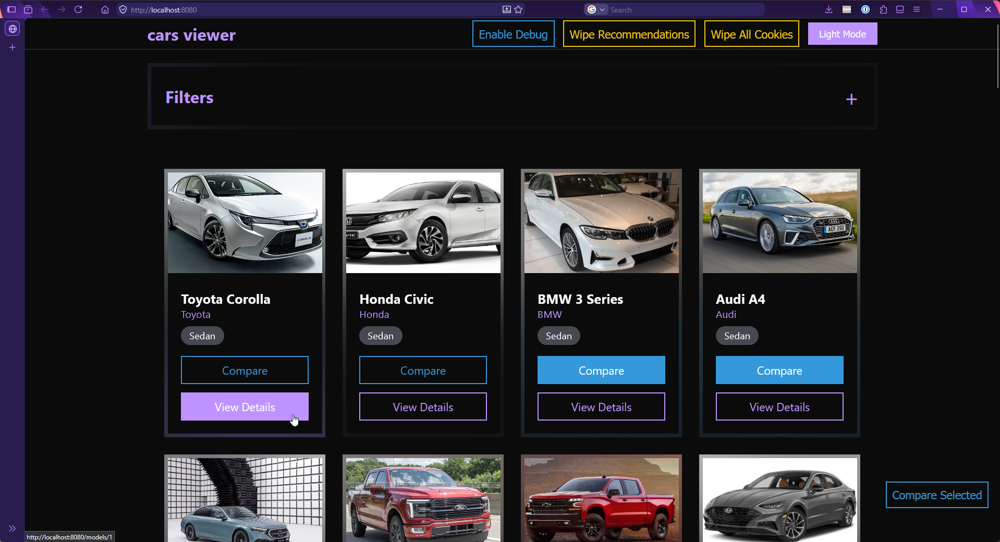
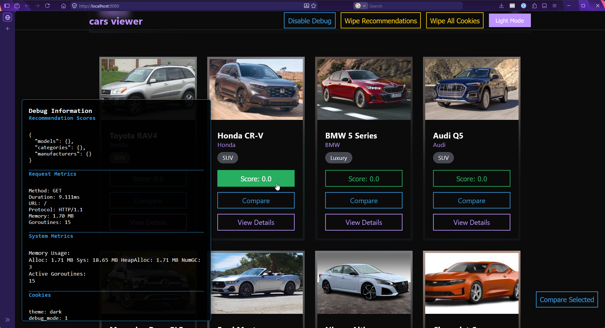

---

### art – ASCII Art Encoder/Decoder (2025)
**Solo project**


https://github.com/user-attachments/assets/7b864a31-e132-48a5-8718-e07ebf4774b1

https://github.com/user-attachments/assets/434fe3ba-1dd1-4ba0-9055-5b6b800407a2

CLI and web tool for encoding and decoding ASCII art shorthand.

- Custom parser with strict and relaxed error modes
- Color control blocks with CSS-like syntax - CLI supports named colors, web version supports any HTML color name or hex value
- Reusable color library used across the entire Go module
- Session persistence via cookies in the web version
- File import/export with auto-detection based on extensions (`.encoded.txt` gets decoded, `.art.txt` gets encoded)
- Multiple input modes: literal strings, files, mixed
- Rainbow mode for when regular colors aren't enough

[](https://github.com/mikapitkala/projects-readme/tree/main/art) [-181717?style=for-the-badge&logo=github&logoColor=white)](https://github.com/mikapitkala/art)

---

## Personal Projects

### Monitor Monitor (2026)
**Solo project** | Colleague complaint rabbit hole


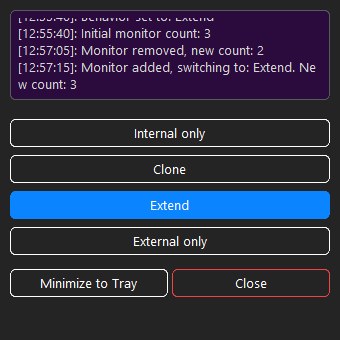

System tray utility that watches for display connection changes and automatically switches Windows to a preferred mode (default: Extend) instead of the usual Clone default. Originally a messy work script, rewritten as a proper public repo.

- Polls WMI (`WmiMonitorBasicDisplayParams`) every 3 seconds for display count changes
- When a new display appears, fires `DisplaySwitch.exe` with the configured mode
- Four modes: Internal only, Clone, Extend, External only
- Quick-switch via tray icon or double-click in the UI
- Follows Windows light/dark mode preference
- Command line args for startup folder automation
- PyInstaller-packaged exe, mostly to sneak around endpoint protection at work (Python was allowed)

**Why would you poll instead of using `WM_DISPLAYCHANGE`?** Because I could not get the event to fire reliably when plugging in monitors (the resolution doesn't necessarily change). Polling was a silly solution to a stupid problem.

[](https://github.com/mikapitkala/monitor-monitor)

---

### vscode2markdown (2025)
**Solo project** | Tiny workflow tool


https://github.com/user-attachments/assets/ee7f6726-cdf3-46c2-99a1-f6443590e941

One-keypress AutoHotkey script for wrapping selected VS Code text in a properly formatted markdown code block with language hint and file path. Paste-ready output for Discord, chats, or documentation.

- Grabs the selected code, pulls the relative file path via VS Code's built-in "Copy Relative Path" command, detects language from the extension
- Not a real project - just tired of typing backticks

[](https://github.com/mikapitkala/vscode2md)

---

### Batch 3D File Converter for Blender (2024)
**Solo project** | Kitbashing helper


Python script that scans a directory for 3D models (`.fbx`, `.obj`, `.stl`) and batch-converts between formats using Blender's Python API. Born from the recurring problem of purchased asset packs somehow always being in the wrong format for whatever app I want to use them in.

- Scans recursively and only converts when the target format doesn't already exist
- Geometry only (no UVs, textures, rigs, animations)
- Runs from Blender's scripting tab or any external Python environment with `bpy` available

[](https://github.com/mikapitkala/bpy_batch_converter)

---

### Louie – Discord Community Bot (2022 – present)
**Solo project** | Named after one of the drones in Silent Running


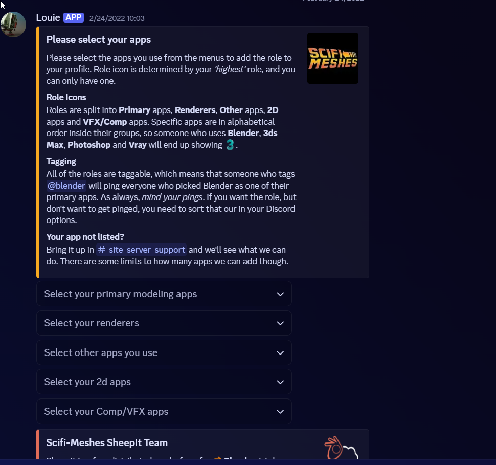

Community moderation and role management bot for the Scifi-Meshes Discord server. Started on Heroku, migrated to Digital Ocean when Heroku axed their free tier.

- **Cross-channel spam detection** - tracks message patterns across channels within a sliding window, normalizes content to catch variations, takes action when patterns match known spam behavior
- Automatic timeout, message deletion, admin alerting with payload preview for review
- Race condition handling to prevent duplicate responses during cleanup
- Periodic memory cleanup for long-running deployments
- Permission-aware (mods bypass, respects Discord role hierarchy)
- **Self-service role management** - users pick their 3D/2D/render/VFX apps from dropdown menus, bot manages Discord roles accordingly (~75+ apps across 5 categories, each with custom emoji)
- Role icon determined by highest-priority role, so a user with Blender, Photoshop, and Vray shows the Blender icon
- **Auto-threading** in designated channels - new posts without embeds or attachments get deleted (with a polite DM explaining why), valid posts automatically get a "Comments" thread for discussion
- **Rules embed generator** - admin command that posts a multi-embed rules document with cross-references to actual channel IDs
- Slash commands with admin-only permissions, ephemeral replies for status checks and tests
- Modular command and event loading from directories

[](https://discord.scifi-meshes.com)

---

### Scifi-Meshes.com (2018 – present)
**Solo project** | Community forum built and maintained


Long-running 3D sci-fi art community forum (running since 2001, data from 2006 onwards). In 2018, migrated from vBulletin to Vanilla Forums while simultaneously redesigning it.

**Migration approach:**
- Official Vanilla Porter couldn't handle our data - attachments broke it entirely, and the old forum had to keep running during migration so cleaning up source data wasn't feasible
- Read Porter source code to understand the target schema, and mapped the vBulletin schema to that
- Built a regex-based transformation pipeline with... let's say *multiple* capture groups to rebuild tables from CSV dumps
- Two-pass approach: generate `GDN_Media` inserts first, then a second regex reads those inserts and generates `UPDATE` statements that inject `[img]` BBCode tags into the referenced posts
- Migrated all active users (with posts or login within 5 years), threads, comments, attachments, private messages
- Restored functionality lost to vBulletin updates: Custom gallery addon content converted to regular posts in **Finished Work** forum. Third party Downloads section converted to regular forum posts on a new **Releases** forum.

**Customization:**
- Custom theme system with 3 color schemes in regular and compact variants plus a mobile version
- Social media, app usage, and commission status displayed as icons in comment author info
- User-configurable draft autosave (database, localStorage, or off)
- Category-specific thread prefixes for navigation and filtering
- Bandwidth-optimized thread thumbnails via ImageKit
- Analytics, cookie consent, custom header, and Discord widget integrations
- Privacy tooling: user data export, self-delete, GDPR-compliant privacy policy
- SphinxSearch for full-text search
- Multi-layer antispam with tiered new member permissions
- Badge, reputation, and reaction system

Still running on a LAMP stack I maintain on Digital Ocean. Currently considering a rewrite in something like Go, HTMX, AlpineJS, Tailwind and SQLite as one inevitably does occasionally. How hard could it be, right?

<details>
<summary>There *has* to be a better way</summary>

```
Prep
"" -> "
' -> \\'
\r\n -> \\r\\n
\n -> \\r\\n
' -> \\'

New Comments
"(\d+)","(\d+)","\d+","\w+","(\d+)",,"(\d+)","(.*?)","\d+","\d+","(\d+\.\d+\.\d+\.\d+)","\d+","\d+","\d+","\d+","\d+","\d+","on_nl2br"\\r\\n
-->
INSERT INTO `GDN_Comment` VALUES \(\1,\2,\3,\3,NULL,'\5','BBCode',FROM_UNIXTIME\(\4\),NULL,NULL,'\6',NULL,0,0,NULL\);\r\n

New Threads
"\d+","(\d+)","\d+","\w+","(\d+)","(.*?)","(\d+)","(.*?)","\d+","\d+","(\d+\.\d+\.\d+\.\d+)","\d+","\d+","\d+","\d+","\d+","\d+","on_nl2br"\\r\\n
-->
INSERT INTO `GDN_Discussion` VALUES \(\1,NULL,NULL,18,\2,NULL,'','','\3','\5','BBCode','',0,NULL,0,0,0,0,FROM_UNIXTIME\(\4\),NULL,'\6',NULL,'','',NULL,NULL,NULL,NULL,NULL,0\);\r\n

Attachments
"(\d+)","\d","(\d+)","(\d+)","(\d+)","(\d+)","visible","\d+",,"(.*?)\.(.*?)",NULL,"\d+",NULL,"0"
-->
INSERT INTO `GDN_Media` VALUES \(\1,'\6\.\7','vb_attachments/\3/\5\.\7','image/\7','',\3,FROM_UNIXTIME\(\4\),\2,'comment',NULL,NULL,NULL,NULL,NULL\);

Attachments to posts
INSERT INTO `GDN_Media` VALUES \(\d+,'\w+.\w+','(vb_attachments/\d+/\d+.\w+)','\w+/\w+','',\d+,FROM_UNIXTIME\(\d+\),(\d+),'(\w+)',NULL,NULL,NULL,NULL,NULL\);
-->
UPDATE `vanilla25`.`GDN_\u\3` SET `Body`= CONCAT\(`Body`, '\\r\\n[img]https://[HOST]/forums/uploads/\1[/img]'\) WHERE `\u\3ID`='\2';
```

But, it worked. Mostly.

</details>

[](https://www.scifi-meshes.com) [](https://discord.scifi-meshes.com)

---

## Work Projects

### Jira Workflow & Budgeting Automation (2022 - 2023)
**Solo project** | WithSecure


Updated localization Jira workflow with automated data collection and budget tracking. Getting my own custom Jira workflow instead of the generic one is actually something of a career highlight.

- Designed to keep the localization operation running with a significantly smaller team after the corporate demerger
- Automated work tracking, timing, and cost calculation at the ticket level
- Generated open data that other parts of the company could consume for their own reporting
- Removed the manual spreadsheet work that was eating into delivery time
- Made the team's output and patterns visible to stakeholders without anyone having to compile reports

---

### FS_XLIFFer – Format Normalization Tool (2020)
**Solo project** | F-Secure


Internal tool at F-Secure for standardizing localization source formats. Effectively a superset of Projectinator - includes all its intake functionality plus format conversion.

- Converts various input formats (CSV, XLSX, inline tags) into standardized XLIFF kits
- CAT-tool-agnostic output - any translation tool can consume the results
- Includes Projectinator's project creation and intake functionality so you don't have to hop between tools
- Integrated with the Weekly Kit
- Bootstrap-based UI customized to match the company branding at the time

---

### Projectinator – Order Intake System (2019)
**Solo project** | F-Secure


Web-based intake system for localization project tracking.

- Simple web forms that got 100% of tasks into Jira without anyone having to learn Jira
- Streamlined order form for customers
- Internal conversion tools for the team to turn emails, Teams messages, smoke signals, corridor ambushes and other ad-hoc requests into standardized tickets
- Bootstrap-based UI customized to match the company branding at the time
- 100% of projects tracked in Jira
- Functionality later folded into FS_XLIFFer for a more unified experience

---

### Moderately Interactive Glossary (2019)
**Solo project** | F-Secure


Web-based terminology glossary for the localization team and product organization.

- Simple, searchable interface for terminology lookups in 30+ languages
- Auto-updated as part of the Weekly Kit delivery cycle, so the glossary was always current without anyone having to maintain it manually
- "Report bad description/translation" button that generated a pre-filled Jira ticket with the term context - low usage in practice, but the low-friction path was there
