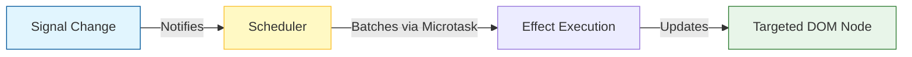
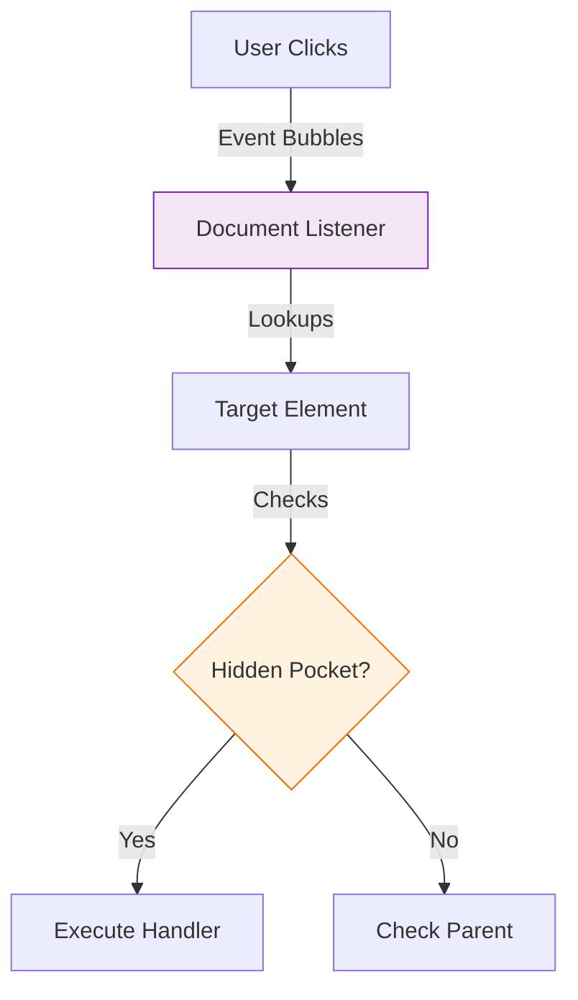

# Architecture & Concepts

## 🏗 Inversion of Control

dot-js implements **Inversion of Control** for state management. Instead of components "rendering" constantly, they run **once**. Signals and Effects take over, surgically updating only the exact text nodes or attributes that changed.

## The Reactive Flow

1.  **Signal Change**: You update a value.
2.  **Scheduler**: Updates are batched to prevent layout thrashing.
3.  **Targeted Update**: Only the specific DOM node bound to that signal is touched.

## 🏎 Performance & Scheduler

### The Scheduler
Updates are **asynchronous** and **batched**. If you change a signal 100 times in a loop, the DOM updates exactly **once** at the end of the microtask queue.

### Memory Comparison: 10k Rows

| Metric | Vanilla JS (Naive) | dot-js (Delegated) |
| :--- | :--- | :--- |
| **Event Listeners** | 10,000 | **1** |
| **Creation Time** | ~150ms | **~40ms** |
| **Memory Usage** | High (Closure overhead) | **Low** (Shared references) |

## ⚡ Rendering Optimizations

dot-js isn't just fast because of signals; it optimizes the actual DOM operations to minimize browser reflows.

### 1. O(1) Direct Text Updates
When a signal containing a primitive value (string/number) changes, we **do not diff the DOM**. We hold a direct reference to the `TextNode` and update its `.data` property directly.
*   **Result**: 6000+ FPS in high-frequency update scenarios (Game Loops).
*   **Comparison**: React must traverse the component tree and diff the Virtual DOM (O(N)).

### 2. Batched List Operations
*   **Creation**: We use `DocumentFragment` to build entire lists off-screen and insert them in a single operation.
*   **Deletion**: We use the `Range` API to delete thousands of rows in a single browser paint, rather than removing nodes one by one.

## Event Handling: The "Hidden Pocket" System

We **do not** attach event listeners to every element. Instead, we use **Global Event Delegation** with a twist.

**The "Hidden Pocket" Strategy:**
We attach handlers to a secret property on DOM elements (e.g., `__dotjs_click`). A single global listener on `document` catches events, finds the target, and looks into its "hidden pocket" to run the handler.

**Why?**
*   **Memory Efficiency**: 1 listener vs 10,000 listeners.
*   **Dynamic**: Elements added later work automatically.
