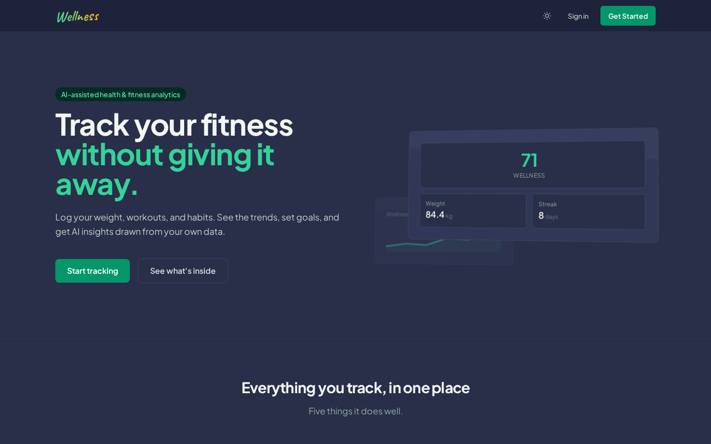
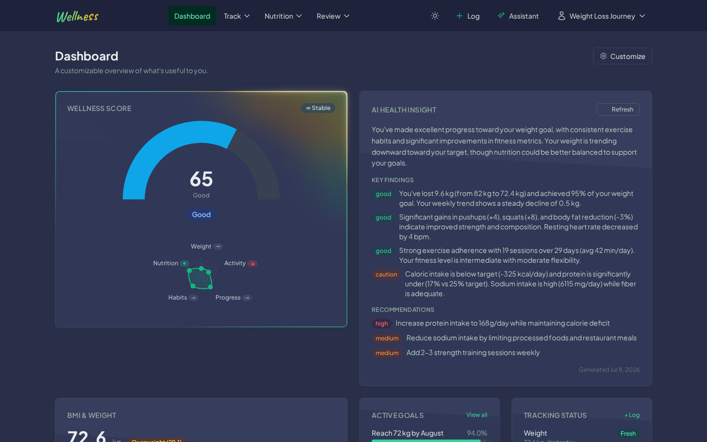
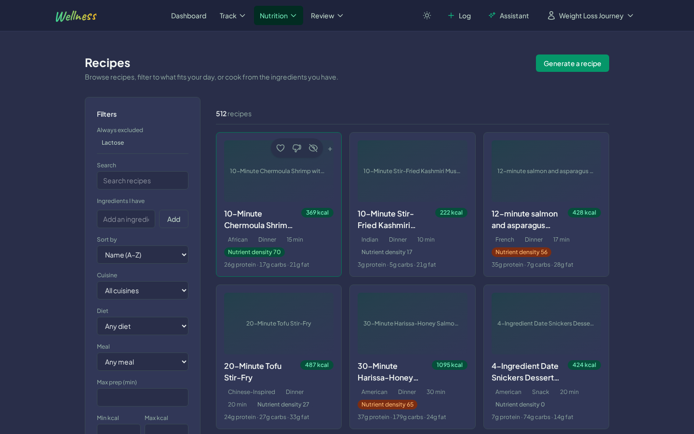
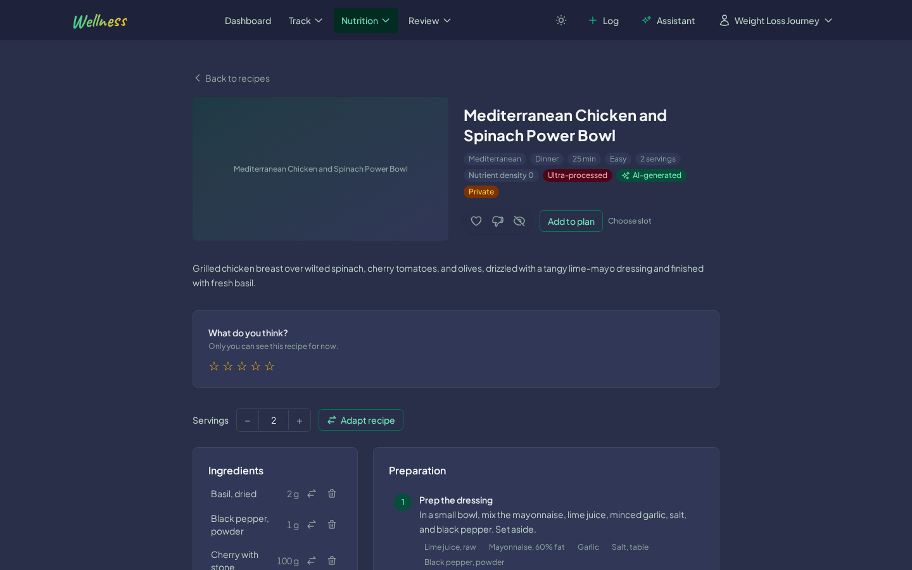
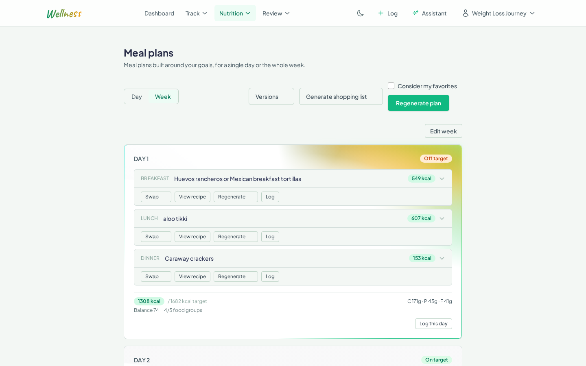
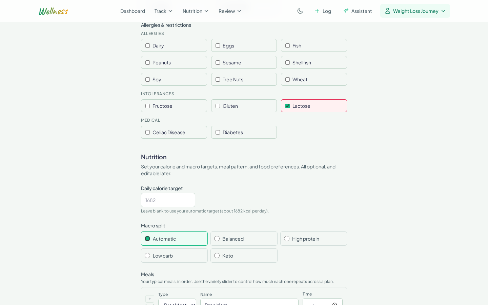
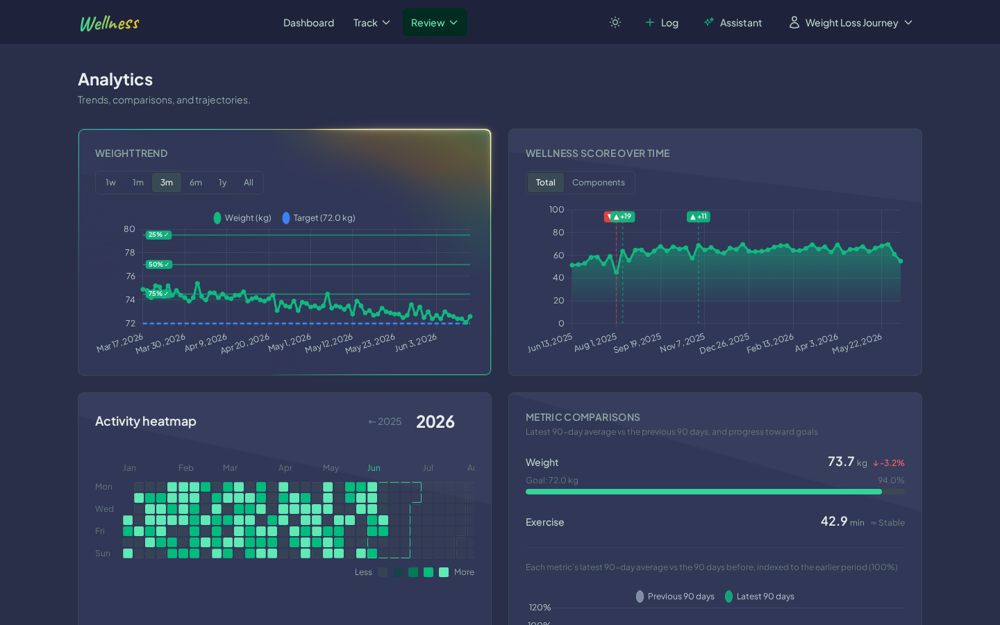
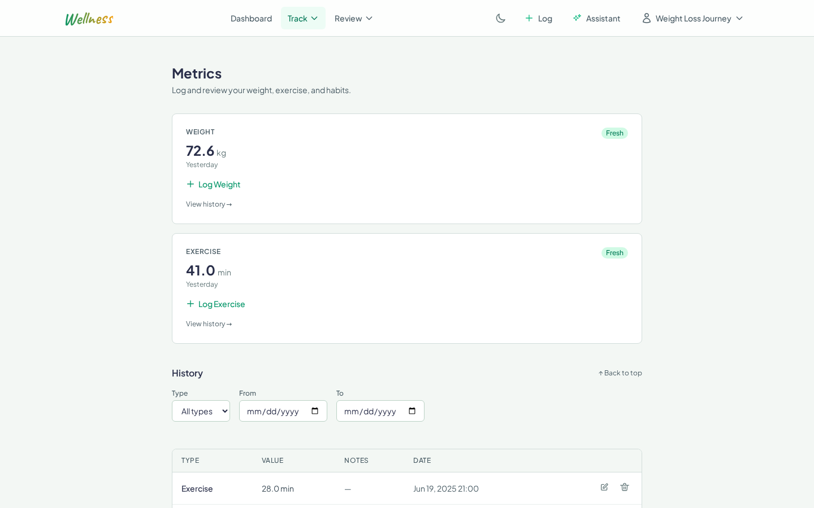
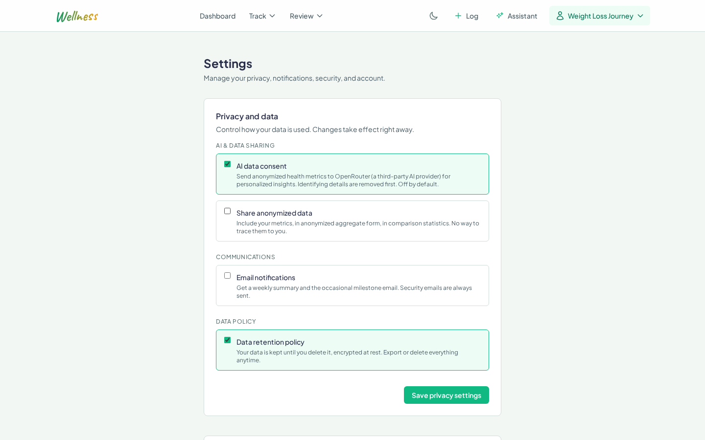
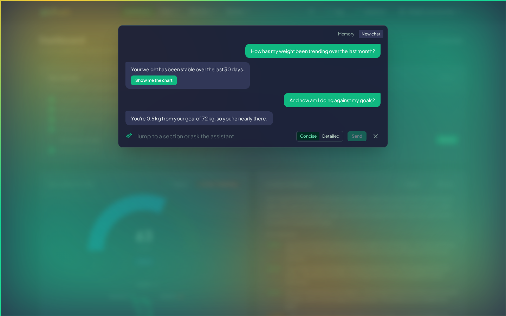

# AI Assistant

Health, fitness & nutrition analytics

## Overview

Wellness is a server-rendered health platform: log your weight, workouts, and habits, see
the trends, set goals, and get AI insights drawn from your own data.

The platform spans Part 1 (health profiles, metrics, analytics), Part 2 (AI meal planning,
RAG-grounded recipe search, function-calling nutrition, nutritional analysis), and Part 3 (a
conversational AI assistant layered over all of it).

## Features

- **Profiles and metrics**: demographics, body metrics, lifestyle, dietary preferences, and
  a fitness assessment. Log weight, workouts, and habits, as many entries a day as you need.
- **Analytics dashboard**: BMI, a 0 to 100 wellness score, goal progress with milestones,
  and charts over time.
- **AI insights**: trend analysis and recommendations in plain language, opt-in and drawn
  from anonymized data only.
- **Multi-method auth**: email and password, four OAuth providers, and optional TOTP 2FA.
- **Privacy controls**: encrypted personal data, explicit consent, JSON export, and account
  deletion, GDPR-aligned by design.

- **AI meal planning**: daily or weekly plans built from your calorie and macro targets,
  dietary preferences, allergies, and meal schedule. A sequential, RAG-grounded pipeline
  builds each plan; every generation is versioned, so you can swap meals, regenerate, or
  restore an earlier version.
- **RAG recipe and ingredient search**: 500+ recipes and 500+ ingredients, retrieved by
  vector similarity over pgvector embeddings and filterable by diet, allergy, ingredient,
  calories, macros, and prep time.
- **Function-calling nutrition**: every calorie and macro figure comes from a deterministic
  `calculate_nutrition` tool over the ingredient database, never from the model's arithmetic.
- **Nutritional analysis**: log intake and compare it to your targets daily and weekly, with
  deficit/surplus, macro breakdowns, trend lines, and AI-written summaries.
- **Micronutrient analysis**: tracking reaches past macros to key micronutrients (vitamin D,
  B12, iron, calcium), with deficiency detection and food suggestions.
- **Shopping lists**: generated from any meal plan, auto-categorized by food group, with
  quantity edits and item exclusions.
- **Recipe management**: browse and filter the catalog, generate original recipes with AI,
  substitute ingredients, and rescale portions (quantities and nutrition recompute via
  function calling).
- **Nutrition-aware wellness score**: the 0 to 100 wellness score gains a nutrition component,
  so eating patterns feed the same score as weight, activity, and habits.

- **Conversational AI assistant**: ask natural-language questions about your own metrics, goals,
  wellness score, nutrition, and meal plans. It answers by calling the same deterministic services
  the dashboard uses (never invented numbers), draws charts on request, proposes every change for
  confirmation before writing, and remembers context across turns and sessions.

## Screenshots

Captured from the seeded demo (`test001`, 365 days of data). Run `--seed` to reproduce.

| | |
|---|---|
| <br>**Landing** | <br>**Dashboard** — nutrition-aware wellness score, AI insights, BMI, goals |
| <br>**Recipes** — browse and filter the catalog by cuisine, diet, and prep time | <br>**AI recipe** — generated recipe with ingredients, steps, and per-serving nutrition |
| <br>**Meal plan** — weekly plan with per-meal nutrition and daily targets | <br>**Profile** — calorie & macro targets, meal template, allergies |
| <br>**Analytics** — weight & wellness charts, activity heatmap, comparisons | <br>**Metrics** — logging and history |
| <br>**Settings** — privacy and consent (GDPR-aligned) | <br>**Assistant** — ask about metrics, goals, and nutrition in plain language; concise/detailed modes, proactive charts, and propose→confirm writes |

## Tech Stack

- **Language**: [Go](https://go.dev/) 1.25
- **Database**: [PostgreSQL](https://www.postgresql.org/) 16 + [pgvector](https://github.com/pgvector/pgvector)
- **HTTP router**: [chi/v5](https://github.com/go-chi/chi)
- **Postgres driver**: [pgx/v5](https://github.com/jackc/pgx)
- **Auth**: [jwt/v5](https://github.com/golang-jwt/jwt), [oauth2](https://pkg.go.dev/golang.org/x/oauth2), [pquerna/otp](https://github.com/pquerna/otp) (TOTP)
- **Frontend**: [HTMX](https://htmx.org/), [Alpine.js](https://alpinejs.dev/), [Tailwind CSS](https://tailwindcss.com/) 4.2, [Chart.js](https://www.chartjs.org/)
- **AI**: [OpenRouter](https://openrouter.ai/) (OpenAI-compatible API)
- **Email (dev)**: [Mailpit](https://mailpit.axllent.org/) (local mail catcher)
- **Reverse proxy (opt-in TLS)**: [Caddy](https://caddyserver.com/)
- **Crypto**: AES-256-GCM, HMAC-SHA256 blind index, [bcrypt](https://pkg.go.dev/golang.org/x/crypto/bcrypt)

## Architecture

Layered pipeline: `handler → service → store → database`.

- **handler** (HTTP only): parse request, call service, render template. No business logic, no SQL.
- **service**: business logic, calculations, validation. Returns typed Go structs. No HTTP, no SQL.
- **store** (data access only): SQL queries, PII encryption/decryption at rest. No business logic.
- **model**: shared domain types across layers.
- **server**: wires chi router, middleware, rate limiters, dependency injection.
- **view**: template renderer with HTMX partial support.

**Server-rendered hypermedia (not a SPA).** No JSON API endpoints. Every route returns HTML. HTMX requests (detected via `HX-Request` header) return only the fragment; full page loads return layout + page content. Alpine.js handles local UI state only.

**Optional services pattern.** Services depending on external config (encryption, auth, email, AI) stay `nil` when unconfigured. Consumers check nil before calling. App starts and serves pages even when not fully configured.

**Error handling.** Errors bubble up the call stack and are handled at the handler layer. Service layer exposes sentinel errors (`ErrEmailTaken`, `ErrInvalidToken`); handlers match via `errors.Is()`. HTMX error responses return HTML fragments with appropriate status codes (422 for validation, 429 for rate limits).

**Rate limiting.** In-memory token bucket per user ID (or `RemoteAddr` for unauthenticated). General, AI, and auth endpoints have separate limiters. Returns 429 with HTMX-compatible fragment and `Retry-After` header.

## Project Structure

```
cmd/
  server/             HTTP server entry point; wires deps, runs migrations on start
  migrate/            Standalone migration CLI
  recipe-etl/         Offline (seed-time): normalize the scraped recipe corpus into recipes_seed.json
  ingredient-etl/     Offline (seed-time): parse Fineli/CIQUAL/USDA into ingredients_seed.json
  ingredient-brands/  Offline audit: flag branded/product ingredients in the catalog
internal/
  config/             Env-based configuration loader
  crypto/             AES-256-GCM encryption + HMAC-SHA256 blind index
  etl/                Offline ETL parsing behind the ingredient/recipe seed corpus
  foodmatch/          Fuzzy resolver: free-text ingredient name to a catalog row
  foodname/           Food-name normalization to a shared canonical key
  handler/            HTTP layer: parse request, call service, render template
  model/              Shared domain types across layers
  seed/               Demo personas + 365 days of metrics for --seed flag
  server/             Router, middleware, rate limiters, dependency injection
  service/            Business logic, validation, AI client (ai/), reference ranges (zones/)
  store/              Data access: SQL queries, PII encryption at rest
  view/               Template renderer with HTMX partial support
migrations/           Raw SQL migrations, numbered NNN_description.sql
scripts/
  etl/                Offline Python recipe-scrapers pipeline (seed-time only, never in the runtime image)
web/
  static/
    css/              Tailwind input + generated output
    js/               Chart.js, charts helper, vendored assets
    img/              App icons (PWA) + OAuth provider marks
  templates/
    layouts/          Base + auth layouts
    pages/            Full-page templates
    partials/         HTMX fragment templates
    emails/           Inline-CSS email templates
docs/                 DEVELOPMENT.md + screenshots (img/)
```

## Prerequisites

- Docker + Docker Compose (needed by every setup below)
- Go 1.25+ (needed by the Task and plain-Go setups, not by Docker-only)
- [Task](https://taskfile.dev/) (`task` CLI), optional but highly recommended: it
  wraps every raw command into one word. See [installation docs](https://taskfile.dev/installation/)
- `golangci-lint` and `gofumpt` (optional, for `task lint` / `task fmt`)

For cross-platform setup (macOS/Windows), secrets handling, and a machine-to-machine
handover checklist, see [`docs/DEVELOPMENT.md`](docs/DEVELOPMENT.md).

## Running It

Three ways to run it, simplest to most involved. Docker is the fastest spin-up and
needs no Go or Task. The Task setup is the day-to-day dev path with live rebuilds and
a Tailwind watcher; Task is optional but highly recommended, since it turns each
multi-step flow into one word. The plain-Go setup is the no-Task fallback, driving Go
and the Tailwind CLI by hand. All three serve the app at `http://localhost:8080`, with
Mailpit (dev email) at `http://localhost:8025`.

### Configure `.env`

All three setups read `.env`, so start here:

```bash
cp .env.example .env
```

1. Generate the three security keys and paste them into `.env`, uncommented:
   ```bash
   task generate-keys        # or run `openssl rand -base64 32` three times
   ```
   `ENCRYPTION_KEY`, `BLIND_INDEX_KEY`, and `JWT_SECRET` each want a fresh 32-byte
   base64 value. Auth needs `JWT_SECRET`; the encryption keys protect PII at rest.
2. Leave every OAuth block commented or blank to hide that provider's sign-in button.
   Fill a provider's `CLIENT_ID` and `CLIENT_SECRET` only when you have them, and its
   button appears on the login page.
3. `OPENROUTER_API_KEY` enables the AI features and the seed (catalog embeddings +
   persona insights). The Docker setup auto-seeds on first boot when it is set (see
   below); without it the app still runs, with an empty catalog and a clear AI
   unavailable state.

### Docker (simplest)

Builds and starts every service (Postgres, Mailpit, app) and runs migrations on
container start. No Go or Task required.

```bash
docker compose up --build
```

On a fresh volume the app auto-seeds once as it boots (the `SEED_ON_BOOT` default in
`docker-compose.yml`), so the recipe/ingredient catalog and demo personas are ready with
no second command. The seed needs `OPENROUTER_API_KEY` plus the three crypto keys in
`.env` (embeddings + persona insights) and takes a few minutes on first boot; without the
key the app still boots, just with an empty catalog. Later boots detect the populated
catalog and skip the seed. Set `SEED_ON_BOOT=false` to opt out.

### Task (recommended for development)

Runs the Go server with a Tailwind watcher for live CSS rebuilds, backed by Postgres
and Mailpit in Docker.

```bash
task tailwind-install     # one-time: downloads the Tailwind standalone CLI (gitignored)
task db-up                # start Postgres (:5433) + Mailpit (:8025) in Docker
task migrate              # apply database schema
task dev                  # server + Tailwind watcher
```

### Plain Go (no Task)

The same local setup, driven by raw commands when you would rather not install Task.
The standalone Tailwind CLI builds the (gitignored) stylesheet; the server runs
migrations on startup.

```bash
docker compose up -d db mailpit     # Postgres + Mailpit only
# Download the Tailwind standalone CLI as ./tailwindcss for your OS/arch from
# https://github.com/tailwindlabs/tailwindcss/releases/latest, then build the CSS:
./tailwindcss -i web/static/css/input.css -o web/static/css/output.css --minify
go run ./cmd/server                 # auto-runs migrations on startup
```

> Want TLS locally? See [HTTPS (opt-in)](#https-opt-in). It runs on the Docker setup
> only; the Task and plain-Go setups serve plain HTTP.

## Configuration

Configuration is environment-based. The groups below cover the common knobs; see
[`.env.example`](.env.example) for the full list and defaults.

- **Server**: `SERVER_PORT`, `BASE_URL`
- **Security**: `ENCRYPTION_KEY`, `BLIND_INDEX_KEY`, `JWT_SECRET`, `ACCESS_TOKEN_EXPIRY`, `REFRESH_TOKEN_EXPIRY`
- **Database**: `DATABASE_URL`. Local Docker Postgres is exposed on **:5433** (not 5432) to avoid clashing with a system Postgres
- **SMTP**: `SMTP_HOST`, `SMTP_PORT`, `SMTP_USER`, `SMTP_PASSWORD`, `SMTP_FROM`
- **OAuth**: Google, GitHub, Discord, Gitea client IDs/secrets
- **AI**: `OPENROUTER_API_KEY`, `OPENROUTER_BASE_URL`, `AI_MODEL`
- **Rate limits**: `RATE_LIMIT_RPM`, `AI_RATE_LIMIT_RPM`, `AUTH_RATE_LIMIT_RPM`
- **Proxy**: `TRUSTED_PROXIES`

## Commands

Tasks are defined in [`Taskfile.yml`](Taskfile.yml) and run via the [Task](https://taskfile.dev/) CLI. Task is a YAML-based task runner written in Go: cross-platform (no shell or `tab` quirks like Make), with `dotenv` support (auto-loads `.env`), built-in parallelism (`deps:`), and nicer syntax than a Makefile.

| Command               | Description                                   |
| --------------------- | --------------------------------------------- |
| `task run`            | Build Tailwind + run server                   |
| `task dev`            | Server + Tailwind watcher in parallel         |
| `task build`          | Compile Go binary to `bin/server`             |
| `task migrate`        | Run database migrations standalone            |
| `task test`           | `go test ./...`                               |
| `task lint`           | `golangci-lint run ./...`                     |
| `task tailwind`       | One-time Tailwind CSS build                   |
| `task tailwind-watch` | Tailwind in watch mode                        |
| `task docker-up`      | `docker compose up --build`                   |
| `task docker-down`    | `docker compose down`                         |
| `task generate-keys`  | Print new encryption, blind-index, JWT keys   |

### CLI flags

Beyond running the server, `cmd/server` takes one-shot maintenance flags. Each runs its task
against the database and exits — it does not start the HTTP server. Invoke with any setup, e.g.
`go run ./cmd/server --seed`, `task seed`, or `docker compose exec app /app/server --seed`.

| Flag | What it does | Needs `OPENROUTER_API_KEY` |
| --- | --- | --- |
| `--seed` | Populate demo data (ingredients, recipes, embeddings, 9 personas) and exit | Yes |
| `--embed` | Backfill catalog embeddings and exit | Yes |
| `--backfill-nutrition` | Recompute recipe per-serving nutrition from ingredients and exit | No |
| `--backfill-tags` | Refresh recipe dietary tags from the seed corpus and exit | No |
| `--backfill-animal-classes` | Refresh recipe animal classes from the seed corpus and exit | No |
| `--backfill-processing` | Refresh recipe processing levels from the seed corpus and exit | No |
| `--gen-meal-plan <email>` | Generate a meal plan for the user with this email and exit | Yes |
| `--meal-plan-scope day\|week` | Scope for `--gen-meal-plan` (default `day`) | — |

Only `--seed`, `--embed`, and `--gen-meal-plan` call OpenRouter (embeddings + generation); the
backfills are pure Go/SQL math. No Task targets wrap `--embed`, the backfills, or
`--gen-meal-plan` yet — run those with `go run ./cmd/server --flag`.

## Seed Data

Populates nine demo personas with profiles, 365 days of metrics, goals, and live AI
insights. Idempotent, so it skips emails that already exist. Requires `OPENROUTER_API_KEY`
(makes ~63 OpenRouter calls with Mistral Small). Use the variant matching how you run it:

```bash
docker compose exec app /app/server --seed   # Docker
task seed                                     # Task
go run ./cmd/server --seed                    # plain Go
```

The ingredient and recipe catalogs are built from third-party open data (Fineli, CIQUAL, USDA,
and scraped recipe hosts). Credits and licence terms are in [DATA_SOURCES.md](DATA_SOURCES.md).

## Usage

Quickest way into a populated app is the seeded demo accounts. A fresh signup walks the
full auth flow end to end.

### Demo logins

After `--seed` (see [Seed Data](#seed-data)), nine demo personas are ready and already
email-verified, so you log straight in at `/login`:

- **Email**: `test001@demo.local` … `test009@demo.local`
- **Password**: `password123`

Each persona comes with a full profile, 365 days of metrics, goals, and AI insights, so
every dashboard and chart is populated on first load.

### Fresh signup

1. **Register** at `/register`. A verification email lands in **Mailpit**
   (`http://localhost:8025`; no real mail in dev).
2. **Verify** via the emailed link, then land in the profile setup wizard.
3. **Profile setup** (`/profile/setup`): a multi-step wizard covering basics, lifestyle,
   dietary preferences and restrictions, fitness assessment, goals, and the privacy and
   consent step (AI consent is opt-in here).
4. **Log metrics** from `/metrics` or the quick-log **+** in the nav: weight, workouts, and
   habits. Add as many entries a day as you need.
5. **Dashboard** (`/dashboard`): your wellness score, BMI, goals, tracking, and AI insights,
   charted over time. The grid is customizable (show/hide, reorder, resize).
6. **Analytics** (`/analytics`): weight and wellness charts, an activity heatmap, period
   comparisons, trends, and AI recommendations.
7. **Goals** (`/goals`): set a target, then watch milestones tick as metrics land.
8. **Assessment** (`/assessment`): record a fitness snapshot — strength, cardio, and body
   composition (body fat, VO2max) — and watch the history and trend chart build over time.
9. **Insights** (`/insights/health_status`): AI health insights by type (health status,
   progress, recommendations, nutrition, summary); generate or regenerate each.
10. **Notifications** (`/notifications`): your notification history.
11. **Export or delete** everything: JSON export at `/profile/export`, account deletion
    (cascades all data) from `/settings`.

### Meal planning & nutrition (Part 2)

Part 2 adds AI meal planning and nutrition tracking on top of the Part 1 profile:

1. **Nutrition preferences** — a confirmation wizard reuses your Part 1 profile (diet,
   allergies, disliked ingredients, activity) and pre-fills calorie and macro targets from
   your BMI and weight goal. You confirm or adjust; nothing already known is re-asked. Fields
   live in the profile setup wizard (`/profile/setup`).
2. **Generate a plan** — from `/meal-plans`, generate a daily or weekly plan
   (`POST /meal-plans/generate`), which runs the sequential RAG pipeline (see
   [AI Strategy](#ai-strategy)).
3. **Adjust it** — swap a meal for an AI-suggested alternative (`.../meals/{id}/alternatives`,
   `.../swap`), regenerate a single meal or the whole plan (`.../regenerate`), adjust a meal's
   portion with a half-serving stepper (`.../portion`), reorder or move meals, or add a manual
   meal by editing a **day** (or, in week scope, the whole **week** at once). Preview any planned
   recipe in place with **View recipe**, or **Log** a single meal or **Log this day** straight
   into your nutrition log. Every generation is a version; restore an earlier one from the
   version history (`/meal-plans/{id}/versions`, `.../restore`).
4. **Shopping list** — generate a categorized list from a plan
   (`POST /meal-plans/{id}/shopping-list`, view at `/shopping-lists`); adjust quantities, check
   items off, or remove them.
5. **Recipes** — browse, search, and filter the catalog (`/recipes`) with sorts (Name, Taste,
   Similar tastes, Top rated, Calories, Prep) and filters for diet, allergy, prep time, calories,
   "ingredients I have" coverage, "good source of" micronutrients, NOVA level, and nutrient
   density; favorite, dislike, or hide recipes, and leave community reviews and ratings. Open a
   recipe (`/recipes/{id}`) for ingredients, steps, and a nutrition chart; generate an original
   recipe (`POST /recipes/generate`), substitute ingredients (`.../substitute`) or **Adapt recipe**
   for a full AI rework, and rescale the serving size (nutrition recomputes via function calling).
   Rate your own AI recipe ≥4★ to publish it to the community.
6. **Track and analyze** — log intake by food search, from a recipe, or by nutrition label
   (`/nutrition/log`), see today vs target on the dashboard (`/dashboard/nutrition-today`), and
   review trends, the calorie trend and heatmap, and deficit/surplus in Progress Charts
   (`/analytics`). AI nutrition summaries appear alongside your other insights.

### The pages

Every section in the top nav and what it's for:

| Section | What it's for |
|---|---|
| Dashboard (`/dashboard`) | Home overview: cards for wellness score, BMI, goals, tracking, today's nutrition, and the latest AI insight. Customize the layout — tick a card to show or hide it, "Move up" / "Move down" to reorder (no drag-and-drop). |
| Metrics (`/metrics`) | Log weight, exercise, and habits; edit or delete past entries in the history list. |
| Goals (`/goals`) | Set wellness goals, edit them inline, mark them achieved or abandoned, filter by status. |
| Assessment (`/assessment`) | Periodic fitness snapshots — strength, cardio, body composition (body fat, VO2max); record, edit, and review the history and trend chart. |
| Meal plans (`/meal-plans`) | View the active day or week plan; generate, regenerate, swap a meal, adjust a portion, log a planned meal, edit a day or week, restore a version, or build a shopping list. |
| Shopping lists (`/shopping-lists`) | Lists built from a meal plan — adjust item quantities or remove items. |
| Recipes (`/recipes`) | Browse, search, and filter recipes; favorite, dislike, or hide them; review them; adapt or substitute ingredients; generate a recipe; or add one to your plan. |
| Nutrition log (`/nutrition/log`) | Record intake by food search, from a recipe, or by nutrition label; see today's totals vs target; filter, edit, or delete entries. |
| Analytics (`/analytics`) | Charts and trends over time — weight, calories, wellness score, activity and calorie heatmaps, comparisons, and recommendations. |
| Insights (`/insights/health_status`) | AI health insights by type (health status, progress, recommendations, nutrition, summary); generate or regenerate each. |
| Notifications (`/notifications`) | Your notification history. |
| Profile (`/profile`) | View and edit profile basics, diet, the meal template, and fitness, plus a change and audit log. |
| Settings (`/settings`) | Privacy and AI-data consent, unit preference, two-factor authentication, and account deletion. |

### AI assistant (Part 3)

Part 3 adds a conversational assistant over everything above: a full-screen overlay you
open with the **Assistant** button in the top nav. It answers natural-language questions about
your own data by calling the same deterministic services the dashboard uses — it never invents
numbers. What you can do:

- **Ask about your data** — metrics and their trends and streaks, goals, wellness score and
  BMI, activity level, nutrition intake and targets, dietary preferences, meal plans, and
  recipes. For example: "How's my weight been this month?", "Am I on track for my goal?",
  "What's for lunch tomorrow?", "What am I allergic to?".
- **Pick a length** — a concise/detailed toggle in the panel sets how much the assistant says;
  the choice is remembered across sessions.
- **See a chart** — ask to *show*, *chart*, or *plot* a subject (weight over time, calories or a
  macro vs target, today's macro breakdown) and it draws inline in the chat; ask to *describe* a
  trend and it answers in words. After a chartable answer it may offer a one-click button to draw
  the chart.
- **Make changes safely** — ask it to log a metric or a meal, generate a plan, or swap or resize
  a meal on your plan. Every change is *proposed* first: you see the resolved numbers and a
  **Confirm** button, and nothing is written until you accept.
- **It remembers** — the assistant keeps the recent conversation in context and carries a few
  durable, non-data facts (like a stated intent) across sessions; live numbers are always
  re-fetched, never remembered stale.
- **Getting started / help** — the empty panel shows a few starter prompts, and you can always
  ask "what can you do?" or "how do I log a workout?" for a plain explanation and a pointer to
  the right page.

The assistant only ever sees your own data, is not a medical tool (it declines diagnosis and
points you to a clinician), and runs only with AI consent enabled in your privacy settings.

### Glossary

Terms the app and the assistant use. The assistant explains these from the same definitions when
asked ("what's a NOVA score?"), and the on-screen badges carry them as tooltips.

- **Wellness score** — a 0-to-100 composite of BMI, activity, goal progress, habits, and
  nutrition, so one number tracks overall wellness over time.
- **BMI** — body-mass index (weight in kg over height in metres squared), reported with its WHO
  classification (underweight, normal, overweight, obese). Height comes from your profile.
- **NOVA score** — a food-processing classification from 1 to 4: 1 is unprocessed or minimally
  processed whole foods, 2 processed culinary ingredients, 3 processed foods, 4 ultra-processed.
  A lower number means less processing.
- **Nutrient density** — a 0-to-100 score of how many nutrients a food provides relative to its
  calories. A higher score means more nutrition per calorie.
- **Body composition** (Assessment) — measurements like body-fat percentage and waist and hip
  circumference, tracked over time with severity bands on each trend chart.

### Auth options

- **OAuth**: sign in with Google, GitHub, Discord, or Gitea. Each links to an existing
  account by verified email.
- **2FA**: turn on TOTP in `/settings`. Recovery codes are shown once, on enable.

### Refresh-token flow

Access tokens last 15 minutes, refresh tokens 7 days, both in httpOnly cookies that HTMX
sends automatically. When an access token expires the next request returns 401, and the
page quietly calls `POST /auth/refresh` to rotate both tokens and replay the original
request, with no visible interruption. To watch it happen: sign in, delete the access
cookie in devtools, trigger any HTMX action, and you'll see the silent refresh and rotation
in the network tab.

### For reviewers

A full test-case playbook (Tier A smoke pass, Tier B deep pass) covering the mandatory
audit criteria lives in [`.context/review_guide.md`](.context/review_guide.md).
Cross-platform setup, secrets, and troubleshooting are in
[`docs/DEVELOPMENT.md`](docs/DEVELOPMENT.md).

**OAuth for local testing.** The providers need client IDs and secrets, which are
per-deployment, kept in `.env` (gitignored), and shared out of band rather than committed.
Two things to know when testing them:

- Callbacks are pinned to `http://localhost:8080/auth/<provider>/callback`, so run with the
  default `BASE_URL` on port 8080 or the provider rejects the redirect.
- All four work with any reviewer account (Gitea uses gitea.kood.tech). Google's consent
  screen is published with the basic `openid`/`email`/`profile` scopes, which need no Google
  verification, so you will see an "unverified app" notice on first sign-in: choose
  **Advanced** then **Continue** to proceed.

Email and password sign-up needs no OAuth keys at all, so the full auth flow (register,
verify by email, sign in) is testable without them.

**AI model.** Insights run through OpenRouter, and the model is set by `AI_MODEL` in `.env`
(default `mistralai/mistral-small-2603`). Swap it for any OpenRouter-supported model without
code changes; the rest of the pipeline (anonymization, validation, caching) is unaffected.

## Testing

Tests live next to the source they exercise (`foo_test.go`) and run in two tiers.

**Unit tier**: no database, runs anywhere with just Go. Covers crypto, analytics, AI
validation, the template renderer, email rendering, and the OAuth provider parsers.
Database-backed tests self-skip when `TEST_DATABASE_URL` is unset, so this stays green
with zero setup:

```bash
task test                                    # = go test ./...
go test ./internal/service/ -run TestName    # single test
```

**Integration tier**: DB-backed tests across `internal/store`, `internal/server`, and
`internal/service`. These evidence the behaviors that need real persistence: GDPR
account-deletion cascade, OAuth verified-email auto-link gate, rate limiting, the
data-retention consent gate, and intentional duplicate-timestamp metrics. They require a
running, migrated Postgres, already true after `docker compose up` (or `task db-up` +
`task migrate`). `TEST_DATABASE_URL` defaults to `DATABASE_URL` (see `.env.example`):

```bash
task test-integration
```

## Linting

`golangci-lint` runs revive (exported-symbol godoc), govet, errcheck, staticcheck,
ineffassign, and unused.

```bash
task lint
golangci-lint run --fix ./...   # auto-fix
```

## Authentication

Sign in with email and password (with email verification) or any of four OAuth providers:
Google, GitHub, Discord, and Gitea. TOTP two-factor is optional, with single-use recovery
codes. Sessions use short-lived JWT access tokens (15 minutes) and longer refresh tokens
(7 days), both in httpOnly cookies and rotated on every use.

## Privacy & GDPR

Your personal details (name, email, OAuth IDs) are encrypted at rest with AES-256-GCM, and
email lookups use an HMAC blind index so they never need decrypting. Nothing is processed
without explicit consent. Export everything as JSON or delete your account, which cascades
to all of your data. The AI only ever sees anonymized data, never personally identifiable
information.

Encryption in transit is available via an opt-in TLS reverse proxy. See [HTTPS (opt-in)](#https-opt-in).

## AI Strategy

This section covers prompt engineering strategy, model selection rationale, few-shot usage,
and community-RAG decisions across Part 2's generative pipeline and Part 3's conversational
assistant. Everything runs through [OpenRouter](https://openrouter.ai/); the client supports
function calling and sequential prompting, which the meal planner, RAG recipe search, nutrition
features, and the assistant all build on directly. If AI is unconfigured or unavailable the app
degrades gracefully (see [Error Handling](#error-handling)). The assistant's own strategy —
function calling, prompt design, model choice, and conversation memory — is written up under
[The conversational assistant](#the-conversational-assistant-part-3) below.

### Prompt-engineering strategy

Meal-plan generation is decomposed into a **four-step sequential pipeline**
(`internal/service/ai/meal_plan.go`), each step consuming the previous step's output:

1. **Strategy** — split the day's calorie and macro targets into per-slot budgets (breakfast,
   lunch, dinner, snacks). Prompt: `prompts/meal_plan_strategy.xml`.
2. **RAG select** — for each slot, retrieve candidate recipes from the catalog by vector
   similarity (banded by slot and budget) and have the model pick one plus a portion factor.
   It selects only; it does no arithmetic. Prompt: `prompts/meal_plan_select.xml`.
3. **Reconcile** — compute each chosen meal's real nutrition through the `calculate_nutrition`
   function tool and compare it to the slot budget.
4. **Refine** — for any day outside tolerance, adjust portions and re-check (up to two
   iterations).

Steps 1–2 use XML prompt templates; steps 3–4 build their prompts inline in Go.

**Why decompose rather than one prompt.** A single "make me a week of meals hitting these
macros" prompt asks the model to retrieve, select, do arithmetic, and self-correct at once —
and the arithmetic is exactly where LLMs are unreliable. Splitting it gives each step one job:
budgets are deterministic, selection is grounded in real catalog rows (RAG, not invention), the
numbers come from Go math via function calling, and refinement is a measured correction loop.
Each step's output is validated before the next runs, so an error is caught early instead of
compounding into an implausible plan.

**RAG pipeline.** Recipes and ingredients are embedded into `vector(1536)` columns
(**database**), a query is embedded the same way (**embedding**), pgvector's HNSW cosine index
returns nearest neighbours filtered by hard constraints like allergens (**retrieval**), those
rows are injected into the selection prompt (**augmentation**), and the model chooses from them
(**generation**). Grounding selection in real, nutritionally-known recipes is what lets the
downstream math be exact and stops the model inventing dishes or numbers.

### Few-shot examples

Every generative prompt carries at least one worked input→output example so the model matches
the exact JSON shape the parser expects:

- `meal_plan_strategy.xml` — targets → per-slot budget array.
- `meal_plan_select.xml` — a slot plus candidate list → the chosen recipe and portion factor.
- `recipe_generate.xml` — a request → a full structured recipe (Phase 8).
- `nutrition.xml` — two examples: a good-adherence day and a partial-data day (Phase 9).

**Selection strategy.** Examples are chosen to pin the output contract and to cover the tricky
cases rather than the easy ones — a nutrition example that shows how to handle missing data, a
strategy example that shows the exact budget-array schema. One or two targeted examples lock
format and edge-case handling without biasing the model toward one cuisine or answer, and they
keep token cost down versus a long example list.

### Model selection

Three model slots, all served through OpenRouter, default to one model but can each be pointed
at a different one (`internal/config/config.go`):

- `AI_MODEL` — default and health insights (default `mistralai/mistral-small-2603`).
- `AI_MODEL_CREATIVE` — recipe and meal-plan generation.
- `AI_MODEL_PRECISE` — nutrition reasoning and function calling.

Two sampling profiles back them (`internal/service/ai/params.go`):

| Profile | Temp | Top-p | Used for |
| --- | --- | --- | --- |
| **Precise** | 0.2 | 1.0 | nutrition reconcile, day refinement, nutrition analysis, ingredient substitution, moderation |
| **Creative** | 0.8 | 0.9 | strategy, recipe selection, recipe generation |

**Why the split.** Recipe generation and selection benefit from variety — a higher temperature
and a trimmed top-p (0.9) widen the phrasing and ingredient choices the model explores, so plans
don't come out identical. Nutrition and function-calling work is the opposite: it must be
consistent and format-exact, so a low temperature (0.2) makes identical data yield an identical
reading, and top-p 1.0 leaves the full distribution to temperature alone. Separate model slots
let you route creative vs precise tasks to different models entirely (e.g. a stronger reasoning
model for nutrition) without touching code, trading off accuracy, format-consistency, cost, and
latency per task.

**Model-agnostic by design.** Nothing is pinned to a specific model or vendor. The client speaks
the OpenAI-compatible API through OpenRouter, so any model OpenRouter serves drops in via an env
var — no code change. Beyond the three role slots, the embedding model is its own knob
(`EMBED_MODEL` / `EMBED_BASE_URL`) and any individual call can override the model per request.
Swapping a model leaves the rest of the pipeline — anonymization, prompts, validation, caching,
function calling — untouched.

### Community-RAG stance

The assignment's "vector DB improves with community preferences" extra is met deliberately on
the **discovery** path, not by popularity-weighting meal-plan generation:

- Community signal (ratings, favourites, collaborative "similar tastes") re-ranks the
  vector-retrieved catalog when you **browse** recipes.
- The corpus **grows on a quality gate**: an AI-generated recipe is embedded into the RAG store
  only after its creator rates it ≥4★, so community feedback controls what enters retrieval.

Rating is kept **out** of the meal-plan generation ranking on purpose: popularity-weighting the
generation loop would pull every plan toward the same few crowd-pleasers and collide with the
variety the planner is built to preserve. This is a designed tradeoff, not a gap.

### The conversational assistant (Part 3)

The assistant is split into two layers, following the assignment: a **Conversation Layer** (the
chat overlay, history, and response rendering) over a **Data Access Layer** (function-calling tools
that wrap the same services the dashboard uses). The entry point is `Service.Ask` → `runAskLoop`
(`internal/service/ai/assistant.go`), a bounded agentic loop (`maxToolIterations = 4`). The
governing rule everywhere below is the same one Part 2 established: **the model selects and explains;
Go computes.** The LLM never does arithmetic and never supplies a number — it picks which tool to
call and narrates the deterministic result.

#### Function calling — the data access layer

The assistant exposes **25 function tools: 14 read and 11 control**. Read tools **auto-execute**
inside the loop and feed their results back to the model for the next step; control tools
**terminate** the loop with a concrete outcome (a navigation target, an offer, or a pending write).

- **Read (14)** — metrics and their history, trend, and streak; goals; wellness score; a cached
  insight; the meal plan; recipe and ingredient search; recipe detail; nutrition targets; dietary
  preferences; and a nutrition summary. Every read tool is **`userID`-scoped** in the query, so the
  model can never see another user's data.
- **Control (11)** — six read-only nav/offer tools (`navigate`, `open_food_log`,
  `find_recipes_by_ingredients`, `render_chart`, `offer_chart`, `offer_page`) and five **write**
  tools (`log_metric`, `log_meal`, `generate_meal_plan`, `swap_meal`, `adjust_portion`).

**Nutrition math and allergens are never the model's job.** Any calorie or macro figure comes from
the deterministic `calculate_nutrition` path over the ingredient database, and allergy filtering is a
hard SQL exclusion in the candidate query — conflicting items are removed before the model ever sees
them, never left to a prompt instruction.

**Writes are propose→confirm, never direct.** A write tool does not mutate anything; it returns a
signed `PendingWrite` describing the resolved change. The user sees the exact numbers and a
**Confirm** button, and only then is the write applied and re-validated. The confirmation token
(`confirm_token.go`) is a `<base64(payload)>.<base64(hmac)>` string whose payload is
`userID|kind|base64(params)|unixSeconds`, HMAC-SHA256 signed with the app's JWT secret, checked in
constant time, user-bound, and valid for **5 minutes** (`confirmTokenTTL`). A token can't be
relocated to another user or replayed after it expires.

**Tool errors self-correct rather than abort.** An invalid tool argument (a bad enum, an
out-of-range window) is validated *before* retrieval and returned to the model as a JSON error
string, so it can retry or fall back to a worded answer within the same turn — the same
self-correction contract described under [Error Handling](#error-handling).

#### Prompt engineering (assistant)

The system prompt is an XML template (`internal/service/ai/prompts/assistant.xml`), loaded verbatim
via `AssistantSystemPrompt()`: purpose, the tool catalog, safety rules, and few-shot examples that
teach **routing** (which tool a question needs) and **answer shape** (grounded, units stated) across
the answer types — health metrics, progress, meal plans, recipe info, nutritional analysis, general
wellness, and the chart scenarios.

- **Response modes.** A concise/detailed toggle threads a `ResponseMode` into the prompt: a
  verbosity directive shapes length, backed by per-mode `max_tokens` caps as a backstop
  (`conciseMaxTokens = 160`, `detailedMaxTokens = 700`). The cap sits well above the target, so it
  rarely truncates — the directive owns length, the cap just bounds a runaway.
- **Personalization.** The user's first name is injected into the prompt so replies can greet or
  address them naturally (with restraint, not every line). It is fetched **past the consent gate**,
  so a name is never sent without AI consent, and an empty name leaves the prompt byte-identical.
- **Guardrails fail closed.** No `ai_data_consent` → `ErrNoConsent` and the assistant refuses before
  any model call. A two-tier `CheckDiagnostic` (keyword prefilter, then an LLM confirmation) screens
  for medical-diagnosis language and **fails closed** — a missing client or a call error is treated
  as diagnostic and declined. Jailbreak, cross-user, and out-of-scope rules live in the prompt and
  reinforce the code-level `userID` scoping.
- **Chart captions are a two-step.** Go computes the factual caption (numbers, trend class, window),
  then a low-temperature LLM pass rephrases it for warmth under a hard *do-not-change-any-number*
  constraint. A `captionNumbersPreserved` guard rejects any fabricated or altered figure, and the
  whole step **fails open** to the raw Go caption on any error or mismatch. The LLM only ever
  rephrases a Go-filled string; the numbers stay server-fetched.

#### Model selection (assistant)

The assistant runs the **precise** sampling profile (`preciseParams`: temperature **0.2**, top-p
**1.0**) rather than the client default. Function calling and grounded data answers must be
consistent and format-exact — identical data should read identically — so low temperature with the
full distribution (top-p 1.0) is the right trade, the same reasoning the nutrition pipeline uses.
Like the rest of the app it stays model-agnostic: the assistant is pointed at `AI_MODEL_PRECISE` and
any OpenRouter-served model drops in via env var with no code change.

#### Conversation management (memory)

Memory is layered, and every layer keeps the **live data out of storage** — numbers are always
re-fetched from the source tools, never remembered stale.

- **Verbatim window.** The most recent `maxHistoryMessages = 10` messages (~5 turns) are replayed
  verbatim for immediate reference resolution ("is *that* enough protein?").
- **Rolling summarization** (bonus). When the window rolls, the scrolled-off span is summarized into
  a compact, note-form running summary (migration `043`, `summaryMaxTokens = 400`), tracked by a
  `summarized_message_count` watermark so summarization only runs on an actual roll. The summary
  seeds a `<memory>` block in the system prompt (empty → prompt byte-identical).
- **Dynamic detail** (LLM-free). Scrolled-out turns are keyword-scored against the current question
  and the top `dynamicDetailTopK = 2` above a threshold are re-surfaced before the verbatim window —
  deterministic, fail-open, no extra model call.
- **Long-term per-user memory** (bonus). A durable per-user profile (migration `044`) holds only
  **non-DB facts** — stated intents, response-mode preference, dislikes beyond stored allergens —
  extracted once at a conversation boundary (`longTermMemoryMaxTokens = 300`) and seeded into every
  new thread. It never mirrors metrics, goals, or targets: those are the DB's job, looked up live. It
  is consent-gated and included in the GDPR data export.
- **History and chart replay.** Reopening the panel replays the stored thread. Charts replay too, but
  their **numbers are never persisted** — migration `041` stores only the chart *request* (kind +
  window) as `chart_request`, and reopening **re-derives the figures live** from the same builders,
  so a replayed chart is always current.
- **Encryption at rest.** Conversation content, summaries, and long-term memory are stored
  AES-256-GCM encrypted (migration `038` onward), each bound to a distinct AAD context —
  `assistant:<uuid>:content`, `:summary`, `:memory` — so a ciphertext can't be relocated between
  columns or users.

## Data Model

Part 2 adds catalog and planning tables to the Part 1 schema (PostgreSQL 16). The core set,
with their defining migration:

- **`ingredients`** (`025`) — the nutrient catalog. Per-100-`unit_basis` macros (`kcal`,
  `carbs_g`, `protein_g`, `fat_g`, NOT NULL), extended macros and micronutrients (nullable),
  `unit_basis` constrained to `g` or `ml`, and an `embedding vector(1536)`.
- **`recipes`** (`025`) — one row per recipe; `steps` is a JSONB `{step, description,
  ingredients}` array (the assignment's `preparation`), plus derived per-serving nutrition and
  an `embedding vector(1536)`.
- **`recipe_ingredients`** (`025`) — recipe↔ingredient junction with `qty` and `unit`.
- **`nutrition_preferences`** (`023`/`024`) — per-user calorie and macro targets, meals per
  day, and per-field source (auto-computed vs user-set).
- **`meal_slots`** (`029`) — a user's custom meal template (roles, names, times, per-slot
  variety).
- **`meal_plans`** (`027`) — append-only, versioned plan headers (`scope` day/week, a
  `version_group_id`, one `active` version per group, snapshot targets).
- **`meals`** (`027`) — per-slot rows (day index, slot, recipe or manual title, portion
  factor, snapshot nutrition).
- **`shopping_lists`** / **`shopping_list_items`** (`030`) — one list per plan; items carry a
  food-group `category` (6-way CHECK), quantity, and removed/checked flags.
- **`nutrition_logs`** (`037`) — intake log with macros/micros snapshotted at log time; recipe
  link is `ON DELETE SET NULL` so history survives recipe deletion.

Plus `recipe_ratings` / `recipe_interactions` / `recipe_reviews` (community signal) and
`assistant_conversations`.

**Vector search.** `ingredients` and `recipes` each carry a `vector(1536)` embedding with an
HNSW cosine index (`025`); the pgvector extension is enabled in `001`. The 1536 dimension is
semi-permanent — changing it needs a migration plus a full re-embed.

**Encryption stance.** Part 1's rule carries forward: only PII (name, email, OAuth IDs) is
encrypted (AES-256-GCM, HMAC blind index for lookups). The catalog, plans, and nutrition logs
are plaintext so they stay queryable for filters, RAG, and analytics.

**Unit standardization.** Data structures use common units throughout: solids in grams, liquids
in millilitres (`unit_basis`), energy in kilocalories, time in minutes (`prep_time_minutes`).
Ingredient nutrition is stored per 100 g/ml.

**Assignment field → column mapping.** The schema carries every field the assignment's Recipe
and Ingredient JSON requires; a few use internal column names.

Recipe:

| Assignment field | Our column |
| --- | --- |
| `id`, `title`, `cuisine`, `meal`, `servings`, `summary`, `dietary_tags`, `source`, `img` | same names |
| `time` | `prep_time_minutes` |
| `difficulty_level` | `difficulty` |
| `preparation` (array of `{step, description, ingredients}`) | `steps` (JSONB, same shape) |
| `ingredients` (array of `{id, name, quantity}`) | join through `recipe_ingredients` → `ingredients` |

Ingredient:

| Assignment field | Our column |
| --- | --- |
| `id` | `ingredients.id` |
| `label` | `ingredients.name` |
| `unit` | `ingredients.unit_basis` (catalog basis) / `recipe_ingredients.unit` (recipe line item) |
| `quantity` | `recipe_ingredients.qty` |
| `nutrition{calories, carbs, protein, fats}` | flat columns `kcal`, `carbs_g`, `protein_g`, `fat_g` (per 100 `unit_basis`) |

## Error Handling

**Sentinel errors + `errors.Is`.** The service and store layers expose typed sentinel errors
(`ErrRecipeNotFound`, `ErrNoConsent`, `ErrShoppingListNotFound`, and the AI set
`ErrAINotConfigured` / `ErrAIUnavailable` / `ErrAIRateLimited` / `ErrAIInvalidResponse`, …).
Handlers match them with `errors.Is` and map each to a status code and an HTMX fragment — never
on error strings. Example fan-out: `internal/handler/recipe_substitute.go`.

**Function-calling error handling.** The `calculate_nutrition` tool path handles all seven
required classes:

| Class | Where | Handling |
| --- | --- | --- |
| Parsing | `nutrition_tools.go` | malformed tool-call JSON → `invalid arguments` |
| Missing parameters | `nutrition_tools.go` | unknown ingredients collected → "not found, use catalog names" |
| Invalid values | `nutrition_calc.go` | bad quantity / unit / servings → sentinel |
| Execution | `nutrition_tools.go` | resolver failure wrapped with context |
| Timeout | `client.go` | context deadline → `ErrAIUnavailable` |
| Rate limit | `client.go` | HTTP 429 → `ErrAIRateLimited` |
| Connectivity | `client.go` | transport error / 5xx → `ErrAIUnavailable` |

Tool errors are returned to the model as a JSON error string rather than aborting the turn, so
it can self-correct (for example, retry with a real catalog name).

**Recovery and graceful degradation.** At least three fallback strategies are in place:

- **Retry** — `withRetry` retries rate-limit and unavailable errors once after a 2s delay;
  parsing and auth errors surface immediately (`client.go`).
- **Insight caching** — insights are append-only with a `stale` flag. When preferences or goals
  change, the latest is flagged stale rather than deleted; the dashboard shows the last good
  insight or a clear regenerate prompt instead of erroring.
- **Deterministic nutrition fallback** — if the model never returns a usable
  `calculate_nutrition` call, the planner computes the meal's nutrition directly in Go
  (`fallbackCalc`, `meal_plan.go`), so a plan is never blocked on a model hiccup.

Across the app, an AI failure degrades to cached content plus an explicit notice; it never
breaks the dashboard or the meal planner, and a clear user-facing message (rate-limited,
unavailable, and so on) is shown with the right status code.

## Units

The backend is metric only by design: weight in kg, height in cm, exercise in minutes.
Everything is stored and validated in metric, normalized before it reaches the database.

A per-account preference (Settings, then Units) switches the display to imperial. Only
weight and height convert (kg to lb, cm to ft and in); minutes, days, and BMI have no
imperial form. Stored values never change, so switching units is lossless and follows your
account across devices.

## Docker

`docker compose up --build` brings up the full stack, three services:

- **db**: `pgvector/pgvector:pg16` with healthcheck
- **mailpit**: a local mail catcher. Outgoing email is trapped here in dev and never actually sent (web UI at `localhost:8025`, SMTP at `localhost:1025`)
- **app**: built from local Dockerfile, depends on db + mailpit. On first boot it runs migrations and, with `OPENROUTER_API_KEY` plus the three crypto keys set, auto-seeds the catalog and demo personas (`SEED_ON_BOOT`); without them it boots with an empty catalog

### HTTPS (opt-in)

Optional encryption in transit, served by a [Caddy](https://caddyserver.com/) TLS reverse
proxy. Caddy provisions and renews the certificate automatically.

Default `docker compose up` serves plain HTTP on `localhost:8080`, unchanged. To
front the app with real TLS, opt in with the `tls` compose profile:

```bash
BASE_URL=https://localhost TRUSTED_PROXIES=172.16.0.0/12 \
  docker compose --profile tls up --build
```

Then browse `https://localhost` and accept the internal-CA cert warning once.
Caddy terminates TLS on `:443` (auto-redirecting `:80`) and proxies to the app.
`BASE_URL=https://localhost` flips Secure cookies on; `TRUSTED_PROXIES` lets the
rate limiter see the real client IP behind the proxy. For OAuth, add the
`https://localhost/auth/{provider}/callback` redirect URI at each provider in use
alongside the existing `http://` one.

**Production TLS.** The app is proxy-agnostic. `redirect_uri` comes from
`BASE_URL` (not the request host) and the Secure-cookie flag from its scheme, so
the same setup drops behind any TLS terminator with no code change:

- **Caddy + Let's Encrypt**: swap `localhost` for the real domain in the
  `Caddyfile`; Caddy then provisions and auto-renews a public cert. Add an HSTS
  header (`Strict-Transport-Security`); Caddy does not send one by default.
- **Cloudflare** (or any edge/LB): terminate TLS at the edge with SSL mode
  **Full (strict)** so the CF→origin hop stays encrypted; set `TRUSTED_PROXIES`
  to the proxy's published IP ranges so `X-Forwarded-For` is trusted (and not
  spoofable). Register the prod-domain OAuth callbacks at each provider.

## Bonus Features

Extras beyond the core brief, all additive and off by default where they touch core flows.

### Part 1 extras

- **Dark mode**: Tailwind `dark:` classes with the preference stored client-side.
- **Weekly digest email**: an opt-in Sunday-morning summary of your week (weight delta,
  exercise, habits, active goals), sent over the same SMTP path.
- **Customizable dashboard**: show, hide, reorder, and resize widgets; the layout persists
  per account.
- **Two-factor recovery codes**: single-use backup codes issued when you enable TOTP, plus
  an email notice on any 2FA change.
- **Imperial units**: per-account metric or imperial display (see [Units](#units)).
- **Accessibility pass**: focus-trapped modals, escape-to-close, and full
  `prefers-reduced-motion` support across charts and overlays.
- **Installable PWA**: web app manifest and icons, so it can be added to a home screen.

### Part 2 extras

- **Single-command Docker**: `docker compose up --build` builds and runs the whole stack
  (Postgres + pgvector, Mailpit, app) and applies migrations on start — no other setup or
  dependency install.
- **Preference-driven personalization**: recipe favorites, dislikes, and discards are recorded
  and feed a preference-aware re-rank of recipe discovery, so browsing sharpens as you signal
  taste.
- **Micronutrients**: beyond macros, the ingredient catalog and nutrition logs carry vitamin D,
  B12, iron, and calcium. The analysis layer surfaces micronutrient intake alongside macros,
  detects likely deficiencies against reference intakes, and recommends allergy-safe foods to
  close each gap.
- **Community-driven RAG**: community signal improves the corpus and its retrieval quality
  through recipe ratings and reviews (review text passes AI moderation), collaborative and
  top-rated discovery sorts that re-rank the vector-retrieved catalog, and quality-gated corpus
  growth where an AI-generated recipe joins the RAG store only after its creator rates it ≥4★.
  Rating is deliberately kept out of meal-plan generation ranking (see
  [Community-RAG stance](#community-rag-stance)).
- **Extended nutrition fields**: beyond macros and micros, ingredients and recipes carry fiber,
  sugar, saturated fat, and sodium, plus a nutrient-density score and a NOVA processing level.

### Part 3 extras

- **Natural-language charts**: ask the assistant to *show*, *chart*, or *plot* a subject (weight
  or exercise over time, calories or any macro vs target, a macro breakdown) and it draws the
  chart inline in the chat, with an AI-polished caption over Go-computed numbers.
- **Proactive chart offers**: after a chartable worded answer, the assistant may attach a one-click
  button to draw the matching chart, or a link to the right page when no inline chart fits.
- **Two-tier conversation memory**: a rolling summary keeps long threads in context past the
  verbatim window, and a per-user long-term memory carries a few durable, non-data facts (like a
  stated intent) across sessions. Live numbers are always re-fetched, never remembered stale.
- **Inline help and glossary**: starter prompts in the empty panel, a "what can you do?" capability
  answer, and grounded concept explanations (NOVA, nutrient density, wellness score) from the same
  definitions the on-screen tooltips use.

## Known Limitations

Some notes on scope and edges:

- **Scope**: this repo is Part 3 of a three-part build. Parts 1 (health analytics), 2 (AI meal
  planning, RAG recipes, nutritional analysis), and 3 (the conversational assistant) are all
  built and carried forward in this tree.
- **No JSON API**: every route returns HTML (server-rendered hypermedia). There is no public
  API for third-party integrations yet.
- **Single-instance rate limiting**: the rate limiter is an in-memory token bucket, so limits
  are per process and do not coordinate across multiple replicas.
- **Imperial coverage**: only weight and height switch to imperial. Imperial profile inputs
  validate on submit rather than in real time, and the rare out-of-range message still reads
  in kg.
- **AI features need a key**: the seed (catalog embeddings, personas, insights) and the AI
  features — meal-plan and recipe generation, nutrition insights — call OpenRouter and need
  `OPENROUTER_API_KEY`. With the key set, `docker compose up` auto-seeds the catalog on first
  boot; without it the app still runs, but the recipe and ingredient catalog stays empty until
  a keyed seed and AI features show a clear unavailable state.
- **Meal-plan generation latency**: generation runs a sequential RAG + function-calling
  pipeline with several LLM round-trips per plan, so weekly plans take a little time to build
  (the UI shows a loading state).
- **Nutrition figures are estimates**: macros and micronutrients come from public food
  databases (Fineli, CIQUAL, USDA) matched per ingredient, so they are close estimates rather
  than lab-measured values, and branded-product specifics are not modeled.
- **Recommendation placement**: AI recommendations render as a flat priority-sorted list
  rather than anchored beside their matching dashboard widget.
- **HTTP by default**: local `docker compose up` serves plain HTTP. TLS is available through
  the opt-in `tls` profile (see [HTTPS (opt-in)](#https-opt-in)).
